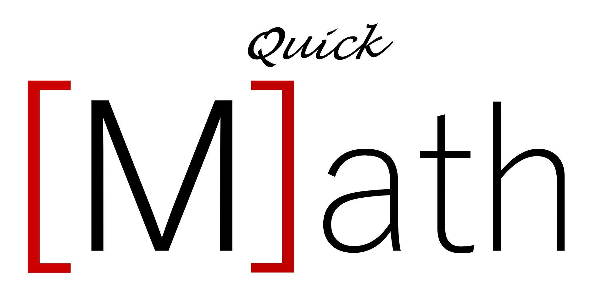

<p align="center"> 

</p>

## MyScript Demo

> What it's suppose to do, results may vary.
<p align="center"> 
  


## Requirements

[Install bower](https://bower.io/#install-bower).

[Then you're gonna want node JS](https://nodejs.org/en/).

Then clone the repo anywhere.

## Important things to do in the place where you cloned it!
Run the following commands in command prompt or terminal at the folder's location.
```shell
bower install myscript
```
```shell
bower install myscript-text-web
```
```shell
bower install myscript-math-web
```

Then in that same folder run the following command.
```shell
python -m http.server
```
Or if you're on mac!
```shell
python -m SimpleHTTPServer
```

Note if this command doesn't work search [running local testing server!](https://developer.mozilla.org/en-US/docs/Learn/Common_questions/set_up_a_local_testing_server)

## Testing if node Js works
Run the following command.
```shell
node nodejstest.js
```
Navigate to the URL (http://127.0.0.1:8000/) and it should be an empty page with "Hello World"

You can also run the following commands to make sure you have all dependencies.

```shell
node -v
npm -v
bower -v
python -v
```
Each command should return the version number of your dependencies.
## In case you need more server requests
1. Create an account [here](https://dev.myscript.com/).
2. Get your keys and the free monthly quota to access MyScript Cloud at [developer.myscript.com](https://developer.myscript.com)
