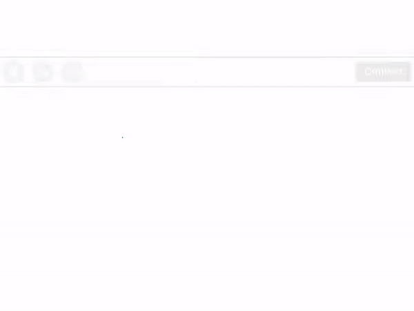

# MyScript Demo
> What it's suppose to do, results may vary.

<p align="center">
  
</p>

# Requirements
[Install bower](https://bower.io/#install-bower).

[Then you're gonna want node JS] (https://nodejs.org/en/).

Then clone the repo anywhere.

# Important things to do in the place where you cloned it!
Run the following commands in command prompt or terminal at the folder's location.
```shell
bower install myscript
```
```shell
bower install myscript-text-web
```
```shell
bower install myscript-math-web
```

Then in that same folder run the following command.
```shell
python -m http.server to run server
```
Note if this command doesn't work search [running local testing server!](https://developer.mozilla.org/en-US/docs/Learn/Common_questions/set_up_a_local_testing_server)

## In case you need more server requests
1. Create and account [here](https://dev.myscript.com/).
2. Get your keys and the free monthly quota to access MyScript Cloud at [developer.myscript.com](https://developer.myscript.com)
