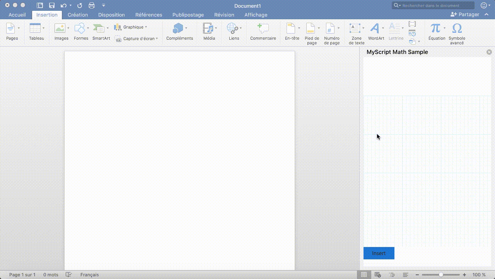

## Word add-in basic sample

Basic sample of mathematical expressions handwriting recognition integration in a Word add-in.

### Installation
You need to install in your windows box:
- Viual Studio
- Office
- https://www.visualstudio.com/en-us/features/office-tools-vs.aspx
- NPM 4.0
- Git

Checkout https://https://github.com/myscript/webcomponents-myscript-web-integration-samples.git

Launch visual by opening MyScript Math Sample.sln

### Testing the UI under Linux

* `cd MyScript\ Math\ SampleWeb`
* `npm install && bower install`
* `gulp serve`

Interaction with office will not work of course

### Learn more

Here are more resources to help you create Word Javascript API based add-ins:

* [Get started with Office Add-ins](https://dev.office.com/getting-started/addins)
* [Office Add-ins platform overview](https://dev.office.com/docs/add-ins/overview/office-add-ins)
* [Build your first Word add-in](https://dev.office.com/docs/add-ins/word/word-add-ins)
* [Develop Office Add-ins for the iPad](https://github.com/OfficeDev/office-js-docs/blob/master/docs/develop/develop-office-add-ins-for-the-ipad.md)
* [Office Add-ins XML manifest](http://dev.office.com/docs/add-ins/overview/add-in-manifests)
* [Office App Compatibility Kit ](https://www.microsoft.com/en-us/download/details.aspx?id=46831)
* [Sideload an Office Add-in on iPad and Mac](http://dev.office.com/docs/add-ins/testing/sideload-an-office-add-in-on-ipad-and-mac)
* [Snippet Explorer for Word](http://officesnippetexplorer.azurewebsites.net/#/snippets/word)
* [Create and debug Office Add-ins in Visual Studio](http://dev.office.com/docs/add-ins/get-started/create-and-debug-office-add-ins-in-visual-studio)